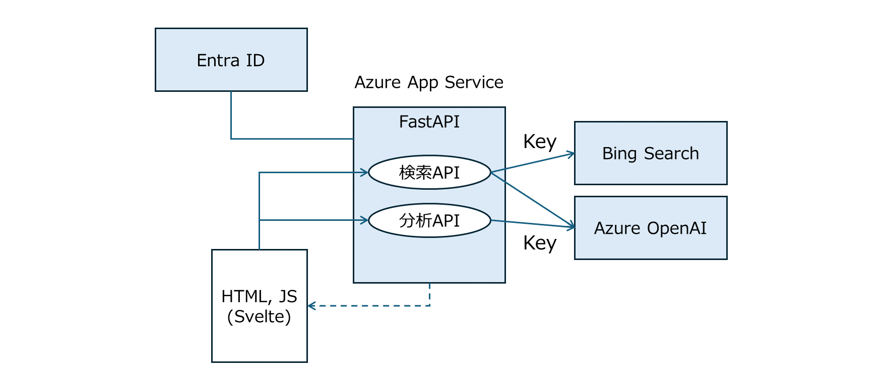
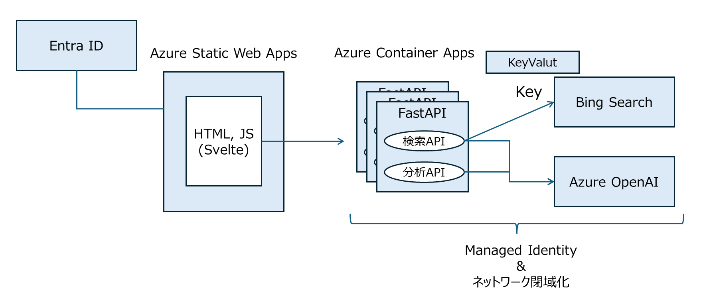

# YourWebCopilot

このプロジェクトは、Bing Web Search API v7 と Azure OpenAI Service を活用したアプリケーションです。ユーザーが簡単に情報検索と AI による高度な分析を行えるように設計されています。 [こちら](https://qiita.com/shyamagu/items/98fe60f6f81b744b97b1) の記事で解説した "検索型" RAG のサンプル実装になります。

**このサービスではスクレイピングを実行します。対象の Web ページがスクレイピングを禁止していないかなどは確認して利用ください。**

このプロジェクト構成としては以下の動作検証を目的とした環境を前提にしています。



もし、本番系をより意識する場合は、このプロジェクトのフロントエンドとバックエンドを分けて以下のような構成を推奨します。



## Azure アカウント

このアプリケーションをデプロイする場合に以下が必要です。

- 有効な Azure アカウント
- 有効な Azure サブスクリプション（Azure OpenAI Service が利用できるもの）
- Azure アカウントの権限
  - `Microsoft.Resources/deployments/write` のサブスクリプションレベルの権限

## Azure へのデプロイ

デプロイする Azure リソースは以下です。

- Azure App Service
  - Azure Service Plan
- Azure OpenAI Service
- Bing Web Search API V7
- (Option) Azure Application Insights
- (Option) Azure Log Analytics Workspace

### プロジェクトのセットアップ

#### ローカル環境

はじめに必要なツールをインストールします。

* [Azure Developer CLI](https://aka.ms/azure-dev/install)
* [Python 3.11](https://www.python.org/downloads/)
  * **注意**: セットアップ スクリプトを動作させるには、Python と pip パッケージ マネージャーに Windows のパスが通っている必要があります。
  * **注意**: コンソールからコマンド `python --version` を実行できるか確認してください。Ubuntu の場合は `sudo apt install python-is-python3` を `python` と `python3` をリンクさせるために実行する必要があります。
* [Node.js 14+](https://nodejs.org/en/download/)
* [Git](https://git-scm.com/downloads)
* [Powershell 7+ (pwsh)](https://github.com/powershell/powershell) - Windows ユーザーのみ。
  * **注意**: PowerShell ターミナルからコマンド `pwsh.exe` が実行できることを確認してください。これが失敗した場合は、PowerShell をアップグレードする必要があります。

このリポジトリをクローンしたディレクトリに移動して、次のデプロイの手順を実行します。

### デプロイ

次の手順に従って、Azure リソースをプロビジョニングし、アプリケーションコードをデプロイします。

1. 環境変数を設定します。その他の項目は `infra/main.parameters.json` を確認してください。
   - `CHATGPT_MODEL`: デプロイする OpenAI のモデルを指定します。デフォルトは `gpt-35-turbo` です。
   - `CHATGPT_MODEL_VERSION`: デプロイする OpenAI のモデルバージョンを指定します。デフォルトは `0613` です。
2. コマンド `azd auth login` を実行します。
3. コマンド `azd up` を実行します。

    `azd up` コマンドを実行すると対話型のデプロイフローが呼び出されます。環境の名前やデプロイする場所を設定してデプロイフローを完了させてください。

    **注意** `azd up` コマンドによって作成された Azure リソースは利用することで費用が発生することに注意してください。リソースが不要になった場合は、コマンド `azd down` でリソースを削除することができます。

4. アプリケーションが正常にデプロイされると、コンソールに URL が出力されます。その URL をクリックして、ブラウザーでアプリケーションを確認できます。

    **注意** この時点では API key が設定されていないため、検索することはできません。

5. Azure Portal を開き、Azure App Service の認証設定（EasyAuth など）を追加します。
6. Azure Portal を開き、Azure OpenAI Service と Bing Web Search V7 の API key を控え、 Azure App Service の構成画面から以下の環境変数に設定します。
   - `BING_API_KEY`: Bing Web Search APIのAPIキー
   - `AOAI_API_KEY`: Azure OpenAI ServiceのAPIキー

## ローカル環境での実行

**注意** ローカル環境での実行は、上記の `azd up` が正常に完了した後に実行できます。

1. `app/backend` ディレクトリに移動します。
2. `.env` ファイルを新規作成し、以下の環境変数を設定します。値は Azure App Service からコピーします。
   - `BING_API_KEY`
   - `AOAI_API_KEY`
   - `AOAI_ENDPOINT`
   - `AOAI_MODEL`
3. 以下のコマンドを実行して、仮想環境を作成し、 Python パッケージをインストールします。

    ```shell
    python -m venv .venv
    activate.bat # Windowsの場合
    pip install -r requirements.txt
    ```

4. 以下のコマンドを実行して、ローカルでアプリケーションを起動します。

    ```shell
    uvicorn main:app --reload
    ```

    起動コマンドや手順の詳細については、 [参考サイト](https://qiita.com/shyamagu/items/4fca59e47ae74b1ebaff) を参照してください。

## GitHub Actions の設定

GitHub Actions を使用して自動デプロイを設定する場合、以下の2つの変数を GitHub の Secrets に登録してください。

- `AZURE_WEBAPP_NAME`: Azure Web App の名前
- `AZURE_WEBAPP_PUBLISH_PROFILE`: Azure Web App の発行プロファイル

これにより、コードの変更が release ブランチにマージされるたびに、自動的に本番環境にデプロイされます。

## 注意事項

このプロジェクトのセットアップと実行には、 `git fork` や `git clone` から始めることを前提としています。上記の手順に従って、必要なサービスと環境変数の設定を行ってください。